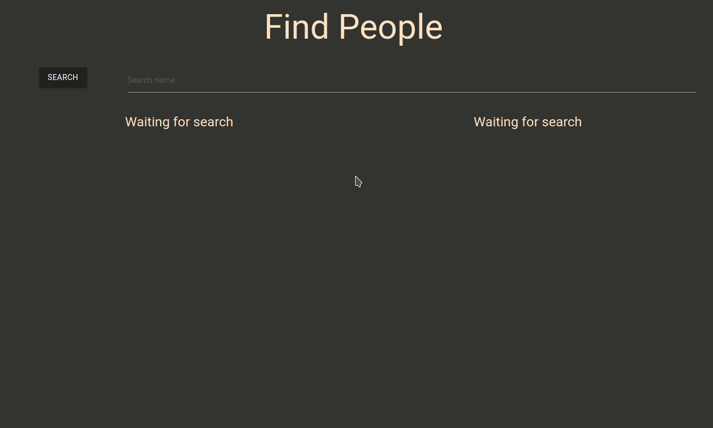

<!-- prettier-ignore -->
<h1 align="center">Find People</h1>

<!-- prettier-ignore -->
<h1 align="center"></h1>

## Sobre

Aplicação para filtrar pessoas e mostrar estatisticas a partir da ocorrência da pesquisa.

Foi desenvolvido para o 2ª desafio no módulo 1 do curso **Bootcamp Desenvolvedor Full Stack** da [**IGTI**](https://www.igti.com.br).

---

## Tecnologias utilizadas

- HTML5
- CSS3
- Javascript puro

---

Desenvolvido por **Denilson Alves**
